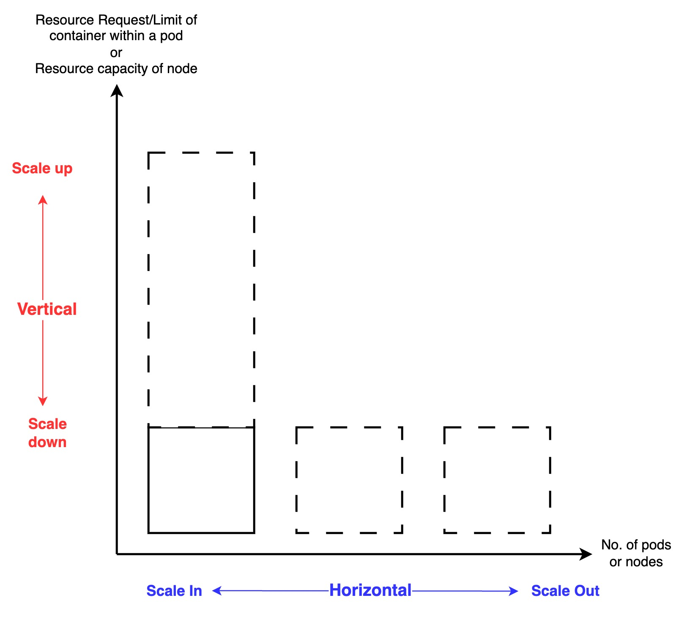

### Check out my article on "Scaling Strategies on AWS EKS: Understanding HPA, VPA, and Cluster Autoscaler"
https://towardsaws.com/scaling-strategies-on-aws-eks-understanding-hpa-vpa-and-cluster-autoscaler-12b88758d1d5

---
> *Caution:* Cost will be involved in creating these resources. For more information, do visit the relavent resource pricing pages as it differs from region to region.
- https://aws.amazon.com/eks/pricing/
- https://aws.amazon.com/ec2/pricing/
---

### To provision the resources in this repository:
1. `git clone https://github.com/Kenny-AngJY/eks-scaling.git`
2. `cd ../terraform`
3. `terraform init`
4. `terraform plan`  
There should be 48 resources to be created.
5. `terraform apply`  
As no backend is defined, the default backend will be local. Do wait for 10-15 minutes for the resources to be provisioned.

### Clean-up
1. `terraform destroy`